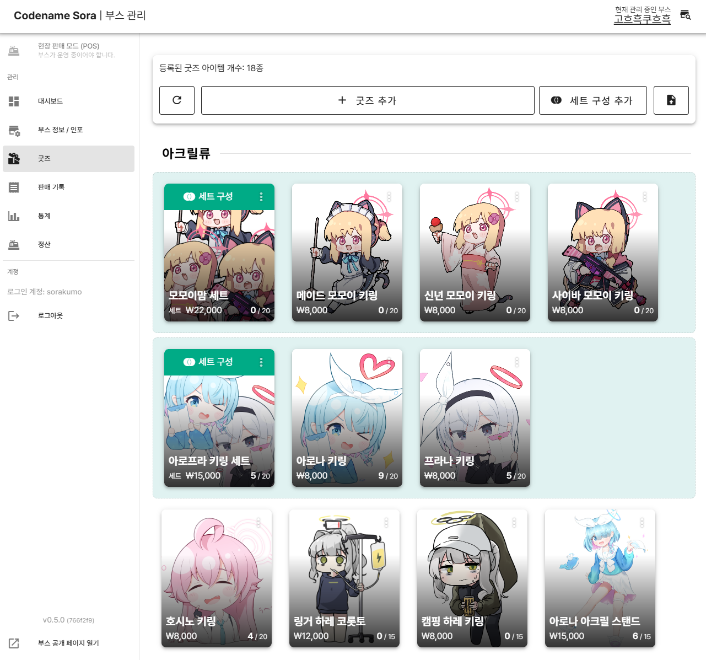
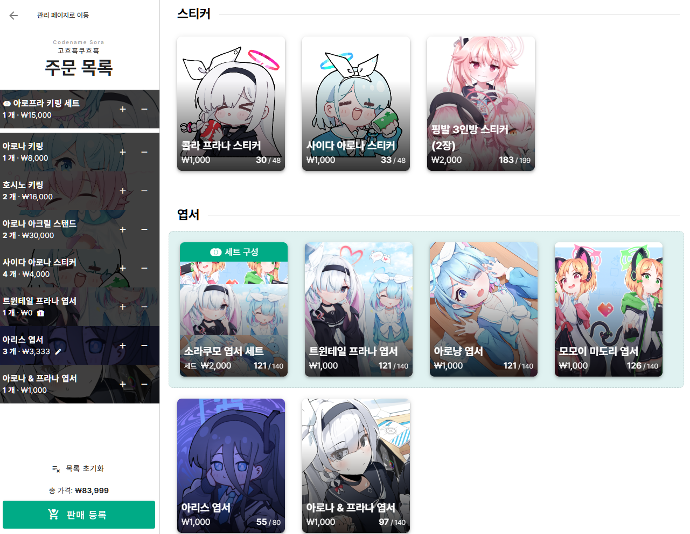
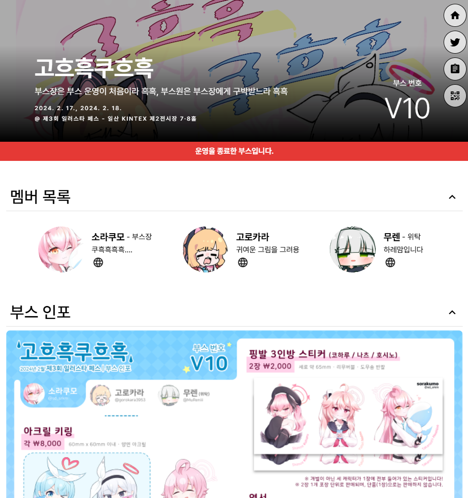

# Codename Sora (MyBoothManager)
이 프로젝트는 **부스 및 굿즈 관리**, 행사 현장에서 사용 가능한 **POS 페이지를 통한 굿즈 판매 기록**, 일반 사용자를 위한 **부스/굿즈 정보 공개 페이지** 등 행사에서 부스를 운영하는 창작자들을 위해 개발 중인 웹 서비스 프로젝트입니다.

This is an in-development project for **managing booths and goods**, recording order histories with the **field-ready point-of-sale (POS) page**, and **providing public pages for visitors/users** to browse the information about booths and goods.

## Screenshots
<table>
  <thead>
    <tr>
      <th>Admin - Goods</th>
      <th>Admin - POS</th>
      <th>Public - Booth</th>
    </tr>
  </thead>
  <tbody>
    <tr>
      <th></th>
      <th></th>
      <th></th>
    </tr>
  </tbody>

  <caption style="caption-side: bottom"><a href="https://github.com/somnisomni/MyBoothManager/tree/766f2f998a6a15bfa1db9ddf72d360d0982fe8d1">v0.5.0 (766f2f9)</a>, 실제 서비스를 사용한 부스의 스크린샷. <i>Thanks to <a href="https://twitter.com/sd_srkm">sorakumo</a></i></caption>
</table>


## Development
### Set up environment
* Initialize the project:
   ```bash
   $ pnpm install && pnpm common:build
   ```
   This will install all dependencies and build the [common](packages/Common) and [common-ui](packages/CommonUI) packages.

* Run the development server of all projects:
   ```bash
   $ pnpm dev
   ```
   This will start the development server for the [frontend admin](projects/Admin), [frontend public](projects/Public), and [backend](projects/Backend) concurrently.

* Apply changes of common packages:
   ```bash
   $ pnpm common:build
   ```
   This will build the [common](packages/Common) and [common-ui](packages/CommonUI) packages.

### Default local development server settings
> To make CORS headers and HTTP cookie work on local environment too, don't navigate to localhost IP address directly.
* **Backend**: [api.sora.localhost:20000](http://api.sora.localhost:20000)
* **Frontend Admin**: [admin.sora.localhost:20001](http://admin.sora.localhost:20001)
* **Frontend Public**: [public.sora.localhost:20002](http://public.sora.localhost:20002)

### Versioning
* This project is *(trying to)* follow [Semantic Versioning](https://semver.org/).
* Also this project is using [`npm version`](https://docs.npmjs.com/cli/commands/npm-version) command to bump the version.
  There is a helper script defined in [root `package.json`](package.json), called `all:version`, which will bump the version of all packages and projects.
  ```bash
  $ pnpm all:version minor  # or major, patch
  ```

## Copyright & License
Copyright © 2023- **[somni](https://github.com/somnisomni)**, All rights reserved.

This project is licensed under the [PolyForm Strict](LICENSE.md) license. <br>
SPDX: PolyForm-Strict-1.0.0 *([not accepted](https://github.com/spdx/license-list-XML/pull/1018))*
